<!-- ────────────────────────────────
     Ashmit Thakur • Profile README
     Polished + glitch-free version
     - Removed duplicate "Profile Views" badges
     - Fixed Typing Intro (image only, no link)
     - Clean section spacing and alignment
     - Multi‑project showcase with repo cards
     - Lightweight, fast-loading embeds only
────────────────────────────────── -->

<!-- Wave Hero Banner -->

  

<!-- Big Typing Intro (no anchor to avoid fallback link text) -->

  

<!-- Quick badges (single, non-duplicated row) -->

  
  
  

---

## Hi there, I'm Ashmit! 👋

I design and build local‑first AI agents that browse, read, and act on the web—while keeping users in control.

- Privacy‑first by design (prefer on‑device LLMs)
- Explainable UX (clear plans, tool logs, step traces)
- From prototype → product with thoughtful docs and demos

---

## What I’m building now

- Local AI Web Navigator — two tracks working together:
  - UI‑first TypeScript/React prototype with Model Picker + voice personas
  - Python/Playwright agent using Ollama for real web automation
- Tool adapters (search, click, extract, summarize) with transparent logs
- Memory + long‑running tasks; multi‑modal voice/screen features

---

## Tech Stack

  

Focus areas:
- Local LLMs & Tooling: Ollama, embeddings, retrieval
- Web Automation: Playwright (Chrome/Edge), structured extraction, scoring
- Frontend Craft: React + TypeScript, Tailwind/shadcn, Vite

---

## Featured Projects

<!-- Row 1 -->

  
  

<!-- Row 2 -->

  
  

<!-- Row 3 -->

  
  

<!-- Row 4 -->

  
  

---

## Skills

- Languages: Python, TypeScript, JavaScript, C/C++, Java, HTML/CSS
- AI/Data: PyTorch, TensorFlow, NumPy, Pandas
- Frameworks/Tools: React, Node.js, LangChain, Flask, FastAPI
- Cloud/DevOps: GCP, Azure, Docker, Kubernetes, Git/GitHub, Linux

---

## Certifications

  
  
   
  <em>Currently pursuing:</em> <strong>DP‑900 (Azure Data Fundamentals)</strong>

---

## Stats & Activity

  
  

  

  

  

---

## Vision: Local AI Web Navigator (at a glance)

```mermaid
flowchart LR
  U[User] --> UI[React UI]
  UI --> C[Controller/State]
  C --> P[Planner]
  P --> M[(Local LLM)]
  P --> T[Tools: Search • Click • Extract • Summarize]
  T --> W[Web]
  P --> MM[(Memory)]
  M --> C
  T --> C
  MM --> P
  C --> UI
```

- UI‑first prototype (TS/React) + Python agent (Playwright + Ollama)
- Transparent steps and logs for trust
- Privacy by default, with simple setup and strong docs

---

## Connect with me

  
  

---

<!-- End name loop (start → end → restart) -->

  

  Last updated: 2025‑10‑24 • Made with ❤️

